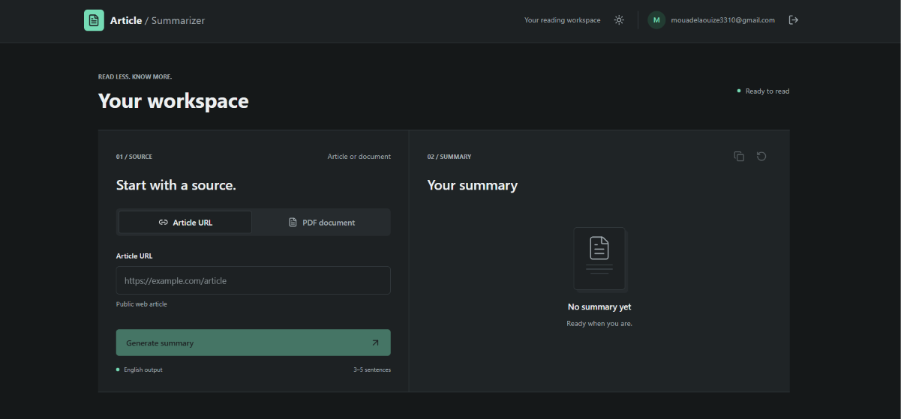
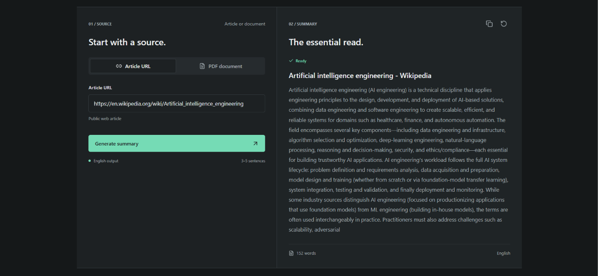
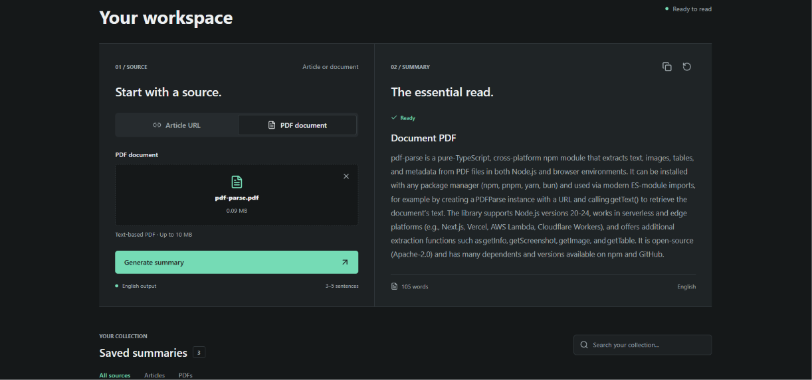
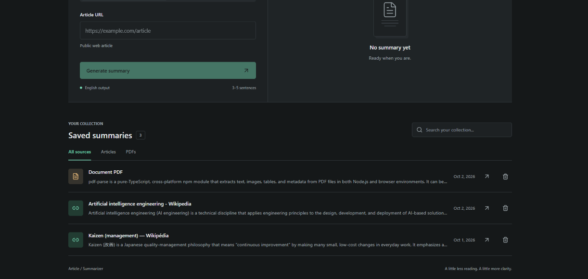

# AI Article Summarizer

A full-stack web application that generates concise English summaries from public web articles and text-based PDF files.

Built with **React 19**, **Vite**, **Tailwind CSS**, **Supabase**, and **Groq**.

[](https://react.dev)
[](https://vite.dev)
[](https://supabase.com)
[](https://tailwindcss.com)
[](https://github.com/Mouad-El-Aouiz/ai-article-summarizer/actions/workflows/ci.yml)

---

## Table of Contents

- [Overview](#overview)
- [Screenshots](#screenshots)
- [Features](#features)
- [Tech Stack](#tech-stack)
- [Architecture](#architecture)
- [Project Structure](#project-structure)
- [Cloud Setup](#cloud-setup)
- [Database](#database)
- [Security](#security)
- [Scripts](#scripts)
- [Continuous Integration](#continuous-integration)
- [Known Limitations](#known-limitations)
- [Troubleshooting](#troubleshooting)
- [Author](#author)

---

## Overview

AI Article Summarizer lets authenticated users submit a public article URL or upload a PDF of up to 10 MB. A secured Supabase Edge Function extracts the source text, sends it to Groq, and returns a short English summary.

Each user has a private summary history protected by PostgreSQL Row Level Security. Summaries can be viewed, copied, regenerated, and deleted from a responsive light or dark interface.

The project uses **Supabase Cloud only**. Docker and a local Supabase stack are not required.

---

## Screenshots

### Workspace

The responsive workspace keeps source input and generated output together in a focused reading interface.



### Article URL

Submit a public article URL and review the generated English summary alongside the source controls.



### PDF Document

Upload a text-based PDF of up to 10 MB and summarize it from the same workspace.



### Saved Summaries

Search, filter, reopen, or delete summaries from the private history associated with the signed-in user.



---

## Features

### Authentication

- Email and password registration
- Email confirmation support
- Login, logout, and persistent browser sessions
- Authentication handled by Supabase Auth

### Summarization

- Public article summarization from an HTTP or HTTPS URL
- Text extraction from PDF files up to 10 MB
- English summaries generated in 3 to 5 sentences
- Summary regeneration and clipboard copy
- Groq model: `openai/gpt-oss-120b`

### Personal History

- Private history for every authenticated user
- View and delete saved summaries
- Data isolation enforced by Row Level Security

### Interface

- Responsive React interface
- Light and dark themes
- Loading, empty, success, and error states
- Accessible labels and semantic form controls

### Input Protection

- Request and content-size limits
- Network request timeouts
- Rejection of unsupported protocols and literal private IP addresses
- Validation of HTML responses and PDF signatures

---

## Tech Stack

| Layer | Technology |
| --- | --- |
| Frontend | React 19, Vite 8 |
| Styling | Tailwind CSS 3.4 |
| Authentication | Supabase Auth |
| Database | Supabase PostgreSQL |
| Authorization | Row Level Security (RLS) |
| Backend | Supabase Edge Functions, Deno, TypeScript |
| AI | Groq API, `openai/gpt-oss-120b` |
| Quality | ESLint, GitHub Actions |

---

## Architecture

```text
React application
   |
   |-- Supabase Auth ---------> Email/password authentication
   |
   |-- Supabase Data API -----> PostgreSQL summaries table
   |                              |
   |                              `-- Row Level Security
   |
   `-- Supabase Edge Function
          |
          |-- Authenticated user validation
          |-- Article or PDF text extraction
          `-- Groq API --------> English summary
```

The browser uses a Supabase publishable key. Sensitive operations remain protected by RLS, while `GROQ_API_KEY` is stored only in Supabase Cloud secrets.

The `summarize-article` function uses `@supabase/server` with `auth: 'user'`. The platform-level `verify_jwt` option is disabled because authentication is performed explicitly inside the function.

---

## Project Structure

```text
src/
├── components/
│   ├── auth/                 # Login and registration
│   ├── common/               # Header, errors, loading state
│   ├── summaries/            # Form, result, history, cards
│   └── ui/                   # Shared input and button components
├── context/                  # Theme context
├── hooks/                    # Authentication and summary history
├── services/                 # Supabase client and summary service
├── App.jsx                   # Application orchestration
├── main.jsx                  # React entry point
└── index.css                 # Tailwind and global styles

supabase/
├── config.toml               # Cloud function configuration
├── migrations/
│   └── 20260930000000_create_summaries.sql
└── functions/
    └── summarize-article/
        ├── deno.json         # Function dependencies
        └── index.ts          # Extraction and Groq integration
```

---

## Cloud Setup

This guide creates a dedicated Supabase Cloud backend for your cloned application. It does not run Supabase locally.

### Prerequisites

- [Node.js](https://nodejs.org) 22 or newer
- npm
- A free [Supabase](https://supabase.com) account
- A free [Groq](https://console.groq.com) API key

### 1. Clone and install

```bash
git clone https://github.com/Mouad-El-Aouiz/ai-article-summarizer.git
cd ai-article-summarizer
npm install
```

### 2. Create a Supabase project

1. Open the [Supabase Dashboard](https://supabase.com/dashboard).
2. Create a new project.
3. Choose a database password and a region close to you.
4. Wait for the project to finish provisioning.
5. Open the project's **Connect** dialog and copy:
   - the **Project URL**;
   - the **Publishable key** beginning with `sb_publishable_`.
6. Copy the project reference from the dashboard URL:

```text
https://supabase.com/dashboard/project/YOUR_PROJECT_REF
```

Never use a secret key or the legacy `service_role` key in the frontend.

### 3. Configure frontend environment variables

Copy the example environment file:

```bash
cp .env.example .env.local
```

PowerShell:

```powershell
Copy-Item .env.example .env.local
```

Complete `.env.local` with your cloud project credentials:

```dotenv
VITE_SUPABASE_URL=https://YOUR_PROJECT_REF.supabase.co
VITE_SUPABASE_PUBLISHABLE_KEY=sb_publishable_your_key
```

Restart the Vite development server whenever these values change.

### 4. Configure email authentication

In the Supabase Dashboard:

1. Open **Authentication > Providers > Email**.
2. Make sure the Email provider and email signups are enabled.
3. Choose whether users must confirm their email address.
4. Open **Authentication > URL Configuration**.
5. Set the local development values:

```text
Site URL: http://localhost:5173
Redirect URL: http://localhost:5173/**
```

When email confirmation is enabled, users must click the confirmation link before signing in. For quick testing, confirmation can be temporarily disabled in the Email provider settings.

### 5. Link the cloud project

The commands below use the Supabase CLI through `npx`, so a global installation is not required.

```bash
npx supabase login
npx supabase link --project-ref YOUR_PROJECT_REF
```

The link command may request the database password created in Step 2.

### 6. Apply the database migration

```bash
npx supabase db push
```

This creates the `summaries` table, its index, and its RLS policies in your cloud database.

### 7. Configure Groq

Create an API key in the [Groq Console](https://console.groq.com), then store it as a Supabase Cloud secret:

```bash
npx supabase secrets set GROQ_API_KEY=your_groq_api_key
```

Do not add this key to `.env.local` or commit it to Git.

### 8. Deploy the Edge Function

```bash
npx supabase functions deploy summarize-article
```

The function is deployed with the authentication behavior defined in `supabase/config.toml`.

### 9. Start the application

```bash
npm run dev
```

Open [http://localhost:5173](http://localhost:5173), create an account, and test an article URL or a text-based PDF.

---

## Database

### `summaries` table

| Column | Type | Purpose |
| --- | --- | --- |
| `id` | `bigint` | Unique summary identifier |
| `user_id` | `uuid` | Owner from `auth.users` |
| `url` | `text` | Article URL or PDF display reference |
| `title` | `text` | Extracted or generated title |
| `summary` | `text` | Generated summary |
| `created_at` | `timestamptz` | Creation timestamp |

Deleting an Auth user also deletes that user's summaries through the foreign key's `ON DELETE CASCADE` rule.

### RLS policies

Authenticated users can only:

- read their own summaries;
- create summaries linked to their own user ID;
- delete their own summaries.

---

## Security

- RLS is enabled on the `summaries` table.
- The frontend contains only a publishable Supabase key.
- `GROQ_API_KEY` remains in Supabase Cloud secrets.
- The Edge Function requires an authenticated Supabase user through `@supabase/server`.
- The function rejects oversized requests and unsupported content.
- Article fetching blocks literal localhost and private IP addresses and limits redirects.
- Error responses do not expose secrets.

The publishable key is intentionally visible in the browser. RLS policies, not secrecy of the publishable key, protect user data.

---

## Scripts

```bash
npm run dev       # Start the Vite development server
npm run build     # Create a production build
npm run lint      # Run ESLint
npm run preview   # Preview the production build
```

---

## Continuous Integration

GitHub Actions runs the following checks on every pull request and every push to `main`:

```bash
npm ci
npm run lint
npm run build
```

The workflow uses Node.js 22 and is defined in `.github/workflows/ci.yml`.

---

## Known Limitations

- Scanned PDFs without a text layer require OCR and are not supported.
- Some websites block automated requests or render their content entirely with client-side JavaScript.
- Article extraction uses HTML cleanup rather than a full readability engine.
- Only the first 12,000 extracted characters are sent for summarization.
- A PDF can only be regenerated while its content remains in the current browser session; PDF bytes are not stored in the database.
- The project does not currently include per-user Groq rate limiting.

---

## Troubleshooting

### `Missing Supabase environment variables`

Confirm that `.env.local` exists and contains:

```dotenv
VITE_SUPABASE_URL=...
VITE_SUPABASE_PUBLISHABLE_KEY=...
```

Restart `npm run dev` after editing the file.

### Registration succeeds but login fails

If email confirmation is enabled, open the confirmation email and click its link before signing in. Also check the spam folder and the Auth URL configuration.

### The Edge Function returns `401`

Make sure you are signed in and that the latest function version is deployed:

```bash
npx supabase functions deploy summarize-article
```

### The database returns a permission or table error

Apply the migration to the linked cloud project:

```bash
npx supabase db push
```

### Summarization is unavailable

Check the cloud secret and function deployment:

```bash
npx supabase secrets list
npx supabase functions list
```

Also verify that the Groq account still has available quota.

### A PDF cannot be summarized

Confirm that the file:

- is a valid PDF;
- is 10 MB or smaller;
- contains selectable text rather than scanned images.

---

## Author

**Mouad El Aouiz**

- GitHub: [@Mouad-El-Aouiz](https://github.com/Mouad-El-Aouiz)
- LinkedIn: [mouad-el-aouiz](https://www.linkedin.com/in/mouad-el-aouiz/)

---

## Acknowledgments

- [Supabase](https://supabase.com) for authentication, PostgreSQL, RLS, and Edge Functions
- [Groq](https://groq.com) for AI inference
- [React](https://react.dev) and [Vite](https://vite.dev) for the frontend foundation
- [Tailwind CSS](https://tailwindcss.com) for styling
